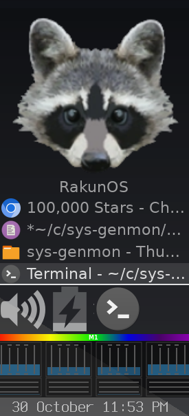
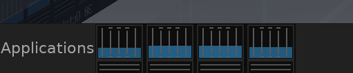

# sys-genmon 
# raccoon edition

<div align="center">

## A beautiful Apple M1 chip monitor for XFCE4 Panel


### Original genmon.



### Raccoon Edition in a vertical deskbar config



### Traditional deskbar config

Real-time visualization of Apple Silicon big.LITTLE architecture with per-core CPU utilization.

</div>

---

## Installation

### Prerequisites

On Alpine Linux, install required dependencies:
```bash
doas apk add build-base libxfce4panel-dev gtk+3.0-dev cairo-dev
```

### Build and Install

1. **Clone the repository:**
   ```bash
   git clone https://github.com/yourusername/sys-genmon.git
   cd sys-genmon
   ```

2. **Build the plugin:**
   ```bash
   ./build-rakunmonitor.sh
   ```

3. **Install to system:**
   ```bash
   doas ./install-rakunmonitor.sh
   ```

   Or manually:
   ```bash
   doas install -m 755 librakunmonitor.so /usr/lib/xfce4/panel/plugins/
   doas install -m 644 rakunmonitor.desktop.in /usr/share/xfce4/panel/plugins/rakunmonitor.desktop
   ```

4. **Restart XFCE Panel:**
   ```bash
   pkill -9 xfce4-panel
   # Panel will auto-restart via session manager
   ```

5. **Add to Panel:**
   - Right-click on your XFCE panel
   - Select "Panel" → "Add New Items..."
   - Find and click "Raccoon Monitor"
   - Click "Add"

---

## Troubleshooting

### Plugin doesn't appear in "Add New Items"

**Symptoms:** Raccoon Monitor is not listed in the panel plugin menu.

**Solutions:**
1. **Verify installation:**
   ```bash
   ls -l /usr/lib/xfce4/panel/plugins/librakunmonitor.so
   ls -l /usr/share/xfce4/panel/plugins/rakunmonitor.desktop
   ```
   Both files should exist.

2. **Check desktop file syntax:**
   ```bash
   cat /usr/share/xfce4/panel/plugins/rakunmonitor.desktop
   ```
   Should contain:
   ```ini
   [Xfce Panel]
   Type=X-XFCE-PanelPlugin
   Name=Raccoon Monitor
   X-XFCE-Module=rakunmonitor
   ```

3. **Restart panel completely:**
   ```bash
   pkill -9 xfce4-panel
   sleep 2
   # Panel auto-restarts
   ```

4. **Check for conflicting plugins:**
   ```bash
   ls /usr/lib/xfce4/panel/plugins/ | grep -i rakun
   ```
   Should show only `librakunmonitor.so`

---

### Panel crashes or fails to restart

**Symptoms:** Panel dies when adding plugin or clicking "Restart Panel".

**Solutions:**
1. **Force kill and let session manager restart:**
   ```bash
   pkill -9 xfce4-panel
   # DO NOT use xfce4-panel -r (restart flag causes D-Bus issues)
   ```

2. **Check for D-Bus errors:**
   ```bash
   journalctl --user -u xfce4-panel -n 50
   ```
   Look for `org.xfce.Panel` service errors.

3. **Manual panel restart:**
   ```bash
   pkill -9 xfce4-panel
   sleep 3
   xfce4-panel &
   ```

4. **Reset panel configuration (NUCLEAR OPTION):**
   ```bash
   # Backup first!
   cp -r ~/.config/xfce4/xfconf/xfce-perchannel-xml/xfce4-panel.xml ~/xfce4-panel.xml.backup

   # Remove plugin from config
   xfconf-query -c xfce4-panel -p /plugins -lv
   # Manually remove problematic plugin entries
   ```

---

### Cores not animating / showing 0% always

**Symptoms:** CPU cores show outlines but blue fill never changes.

**Solutions:**
1. **Check /proc/stat permissions:**
   ```bash
   ls -l /proc/stat
   cat /proc/stat | head -10
   ```
   Should show `cpu0` through `cpu7` lines.

2. **Verify CPU detection:**
   Add debug logging (requires recompilation):
   ```bash
   # Check rakunmonitor.c around line 100 (get_cpu_info function)
   # Ensure sscanf is correctly parsing cpu lines
   ```

3. **Check update interval:**
   Plugin updates every 2 seconds. Wait at least 4 seconds after adding to panel.

4. **Generate CPU load for testing:**
   ```bash
   # Terminal 1
   yes > /dev/null
   # Terminal 2
   yes > /dev/null
   # Should see cores animate now
   # Ctrl+C to stop
   ```

---

### Rainbow header not changing color

**Symptoms:** Rainbow stays same color regardless of CPU load.

**Solutions:**
1. **Generate high CPU load:**
   ```bash
   stress-ng --cpu 8 --timeout 30s
   ```
   Or:
   ```bash
   for i in {1..8}; do yes > /dev/null & done
   # Rainbow should shift red
   # Kill with: pkill yes
   ```

2. **Check utilization calculation:**
   Ensure plugin is reading CPU stats correctly (see "Cores not animating" above).

---

### Plugin shows but is blank/black

**Symptoms:** Plugin appears in panel but shows only black rectangle.

**Solutions:**
1. **Check Cairo/GTK dependencies:**
   ```bash
   ldd /usr/lib/xfce4/panel/plugins/librakunmonitor.so | grep -E 'cairo|gtk'
   ```
   Should show `libcairo.so` and `libgtk-3.so`.

2. **Reinstall dependencies:**
   ```bash
   doas apk add --force-broken-world cairo gtk+3.0
   ```

3. **Rebuild plugin:**
   ```bash
   ./build-rakunmonitor.sh
   doas install -m 755 librakunmonitor.so /usr/lib/xfce4/panel/plugins/
   pkill -9 xfce4-panel
   ```

---

### Compilation errors

**Missing header files:**
```bash
# Error: libxfce4panel-2.0/libxfce4panel.h: No such file
doas apk add libxfce4panel-dev

# Error: gtk/gtk.h: No such file
doas apk add gtk+3.0-dev

# Error: cairo.h: No such file
doas apk add cairo-dev
```

**Linking errors:**
```bash
# Error: cannot find -lxfce4panel-2.0
pkg-config --libs libxfce4panel-2.0
# If empty, reinstall: doas apk add libxfce4panel-dev
```

**Wrong architecture:**
```bash
# Ensure you're on ARM64
uname -m  # Should show: aarch64
```

---

## Uninstallation

To completely remove Raccoon Monitor:

1. **Remove from panel:**
   - Right-click the Raccoon Monitor widget → "Remove"

2. **Remove plugin files:**
   ```bash
   doas rm /usr/lib/xfce4/panel/plugins/librakunmonitor.so
   doas rm /usr/share/xfce4/panel/plugins/rakunmonitor.desktop
   ```

3. **Restart panel:**
   ```bash
   pkill -9 xfce4-panel
   ```

---

## Development

### File Structure

**Essential files:**
- `rakunmonitor.c` - Main plugin source code
- `rakunmonitor.desktop.in` - Desktop entry for panel integration
- `build-rakunmonitor.sh` - Build script
- `install-rakunmonitor.sh` - Installation script

**Build artifacts (ignored by git):**
- `rakunmonitor.o` - Object file
- `librakunmonitor.so` - Compiled shared library

### Building from source

```bash
# Compile
./build-rakunmonitor.sh

# Install
doas ./install-rakunmonitor.sh

# Or manually install
doas install -m 755 librakunmonitor.so /usr/lib/xfce4/panel/plugins/
doas install -m 644 rakunmonitor.desktop.in /usr/share/xfce4/panel/plugins/rakunmonitor.desktop

# Restart panel
pkill -9 xfce4-panel
```

### Debugging

**Enable verbose logging:**
```bash
# Run panel in foreground with debug output
pkill xfce4-panel
PANEL_DEBUG=1 xfce4-panel
```

**Check plugin loading:**
```bash
# See all loaded panel plugins
xfconf-query -c xfce4-panel -p /plugins -lv
```

**Test plugin loading:**
```bash
# Check for library errors
ldd /usr/lib/xfce4/panel/plugins/librakunmonitor.so
```

---

## Technical Details

### Update Interval
- Panel refreshes every **2 seconds** (2000ms)
- Reads `/proc/stat` for CPU utilization
- Calculates per-core usage: `100 * (1 - idle_delta / total_delta)`

### Visual Design
- **Canvas size:** 290px wide × 92px tall
- **P-cores:** 66px wide × 50px tall (5 vertical lines with notches)
- **E-cores:** 66px wide × 26px tall (3 horizontal lines)
- **Rainbow header:** 10px tall, dynamically shifts spectrum based on avg CPU load
- **Background:** 60% transparent black
- **Utilization fill:** Blue with alpha 0.3-1.0 based on load

### CPU Detection
- Detects 8-core layout via `/proc/cpuinfo`
- Cores 0-3: Performance (Firestorm)
- Cores 4-7: Efficiency (Icestorm)
- Falls back gracefully for different core counts

---

## Security Notice

This project follows secure coding practices:

**Security Features:**
- ✅ No file I/O (reads only `/proc/stat`)
- ✅ No elevated privileges required
- ✅ Bounds checking on all array accesses
- ✅ Input validation on CPU stat parsing
- ✅ Uses `snprintf` instead of `sprintf`
- ✅ No dynamic memory allocation during updates

---

## Credits

- **Original inspiration:** xfce4-genmon-plugin
- **Design:** Apple's M1 chip marketing materials
- **Platform:** Asahi Linux project for Apple Silicon support

---

## License

Apache License 2.0 - Go crazy!

---

## Contributing

Contributions welcome! Areas for improvement:
- Support for M1 Pro/Max/Ultra (more cores)
- GPU utilization monitoring (waiting for Asahi DRM fdinfo support)
- Configurable colors/themes
- Per-core frequency display
- Click-to-show-details popup

**Pull requests:**
1. Fork the repo
2. Create feature branch
3. Test on Alpine Linux + Asahi kernel
4. Submit PR with description

---

## Changelog

### v1.0.0 - Initial Release
- Apple M1 8-core visualization
- Real-time per-core CPU utilization
- Dynamic rainbow header
- XFCE4 panel integration
- Transparent design
- big.LITTLE architecture display (5 vertical lines for P-cores, 3 horizontal for E-cores)


## UPCOMING 

### Ability to visualize a heatmap of up to 144 cores, stay tuned :)


Cheers, 

Nisten
